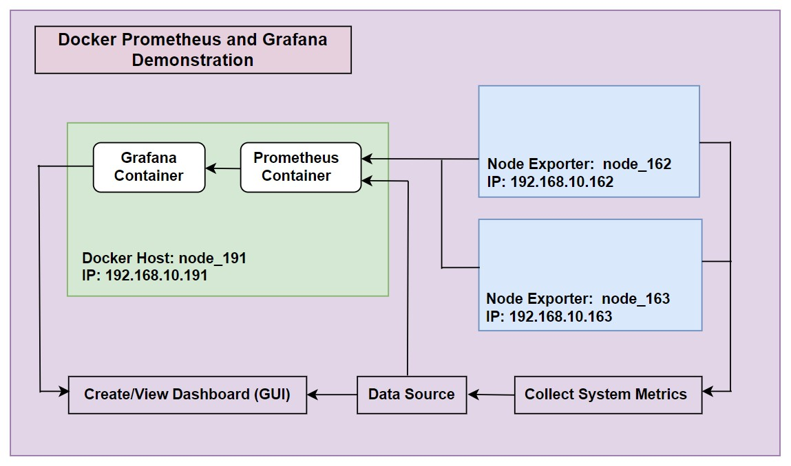
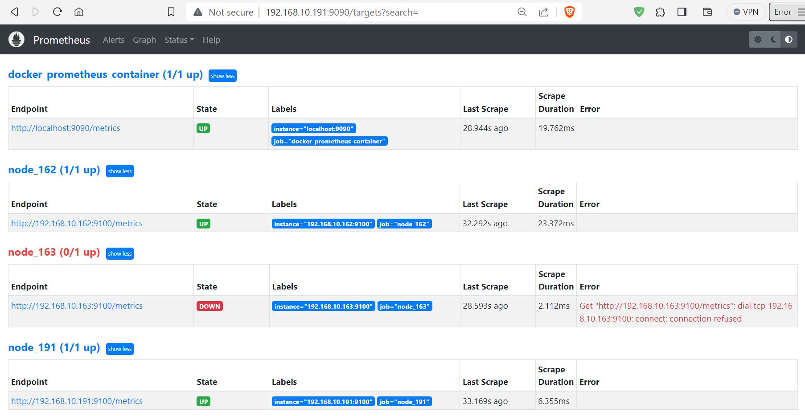
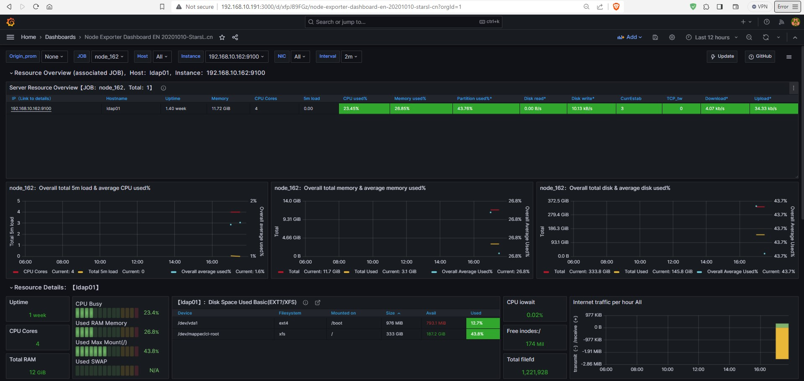

# Real-time Infrastructure Monitoring and Analysis with Prometheus and Grafana:
Setting up Prometheus and Grafana for metrics monitoring using Docker is a convenient and scalable approach. Docker allows you to containerize both Prometheus and Grafana, making it easy to deploy and manage them. Here's a step-by-step guide to set up Prometheus and Grafana for metrics monitoring using Docker:





### Prerequisites:
- A Linux server (CentOS, Ubuntu or any other distribution).
- Docker installed on your system.
- Basic knowledge of command-line tools.

### Pull Docker Images: 

```
docker pull grafana/grafana
docker pull prom/prometheus
```

```
# docker images
REPOSITORY        TAG       IMAGE ID       CREATED       SIZE
grafana/grafana   latest    31656ec60d2e   8 days ago    391MB
prom/prometheus   latest    9c703d373f61   2 weeks ago   245MB
```

### Create a Docker Network: 
It's a good practice to create a Docker network to allow Prometheus and Grafana containers to communicate with each other. Run the following command to create a network:

```
docker network create monitoring
```

### Create a persistent volume:
Create a persistent volume for grafana data (recommended): 

``` 
docker volume create grafana_data
```

### Create configuration and data storage directory:  
```
mkdir prometheus/conf/
mkdir prometheus/prometheus_data/

mkdir grafana/conf/
mkdir grafana/grafana_data/
```

### Configure Prometheus YAML File: 
Add scrape configurations for your targets in the "_scrape_configs_" section. Edit the Prometheus configuration file (prometheus.yml) to define your targets (the services you want to monitor). 

Here's an example configuration for monitoring a local node_exporter instance:

```
vim prometheus/conf/prometheus.yml

global:
  scrape_interval: 15s
      
scrape_configs:   
  - job_name: 'docker_prometheus_container' 
    scrape_interval: 5s 
    static_configs: 
      - targets: ['localhost:9090']
        
  - job_name: 'docker-metrics' #For Docker container monitoring 
    scrape_interval: 5s
    static_configs:
      - targets: ['192.168.10.191:9323']
      
  - job_name: 'node_162' #Node_exporter Node
    scrape_interval: 5s 
    static_configs: 
      - targets: ['192.168.10.162:9100']
      
  - job_name: 'node_163' #Node_exporter Node
    scrape_interval: 5s 
    static_configs: 
      - targets: ['192.168.10.163:9100']
       
  - job_name: 'node_191' #Node_exporter Node
    scrape_interval: 5s
    static_configs:
      - targets: ['192.168.10.191:9100']
        

Save and Quit
```


### Create environment variable file: 
In a Docker-based deployment of Grafana, you can use environment variables to configure Grafana without modifying the Grafana configuration file (grafana.ini) directly. This approach allows you to easily customize Grafana's settings when launching a Grafana container. To do this, you can create a .env file or specify environment variables directly in your Docker Compose file.

``` 
vim .env 

#Grafana Admin user pass:
GF_SECURITY_ADMIN_PASSWORD=admin123

Save and Quit
```


### Create a Docker Compose file:
Creating a Docker Compose file to run Prometheus and Grafana together is a convenient way to manage the setup. Below is a basic Docker Compose configuration that sets up Prometheus and Grafana in separate containers:

```
vim docker-compose.yml

version: '3'
services:
  prometheus:
    image: prom/prometheus
    container_name: prometheus
    restart: always
    networks:
      - monitoring
    ports:
      - '9090:9090'
    user: '0'
    volumes:
      - ./prometheus/conf:/etc/prometheus
      - ./prometheus/prometheus_data:/prometheus
      
  grafana:
    image: grafana/grafana
    container_name: grafana
    restart: always
    networks:
      - monitoring
    ports:
      - '3000:3000'
    user: '0'
    volumes:
      #- grafana_data:/var/lib/grafana
      - ./grafana/grafana_data:/var/lib/grafana
    environment:
      - GF_SECURITY_ADMIN_PASSWORD=${GF_SECURITY_ADMIN_PASSWORD}
    depends_on:
      - prometheus
      
networks:
  monitoring:
    external: true

volumes:
  grafana_data:
    external: true


Save and Quit
```


### Directory Structure: 
```
# ll -a
drwxr-xr-x   4 root root 4096 Sep 27 21:34 .
dr-xr-xr-x. 20 root root 4096 Sep 27 15:48 ..
-rw-r--r--   1 root root  781 Sep 27 21:34 docker-compose.yml
-rw-r--r--   1 root root   62 Sep 27 15:03 .env
drwxr-xr-x   4 root root 4096 Sep 27 14:04 grafana
drwxr-xr-x   4 root root 4096 Sep 27 13:40 prometheus


# tree
.
├── docker-compose.yml
├── grafana
│   ├── conf
│   └── grafana_data
└── prometheus
    ├── conf
    │   └── prometheus.yml
    └── prometheus_data

```


### Dry-run for verify Docker Compose file:
A dry run for verifying a Docker Compose file involves checking the syntax and structure of the Compose file without actually running any containers. 

```
docker-compose -f docker-compose.yml config 
```

### Run the Docker Compose file:
This command will create and start the containers in the background:

```
docker-compose up -d
```

### Verify Container: 

```
docker-compose ps

   Name                  Command               State           Ports
-----------------------------------------------------------------------------
grafana       /run.sh                          Up      0.0.0.0:3000->3000/tcp
prometheus    /bin/prometheus --config.f ...   Up      0.0.0.0:9090->9090/tcp
```


# We can also run as container using this command: 

<details>
  <summary>Create Container (Optional) </summary>

### Run Prometheus Container: 
Run the Prometheus container using Docker, mounting the prometheus.yml configuration file:

```
docker run --name prometheus -dit -p 9090:9090 --network monitoring --user "$(id -u)" -v "./prometheus/conf:/etc/prometheus" -v "./prometheus/prometheus_data:/prometheus" prom/prometheus

```

### Run Grafana Container: 
Run the Grafana container:

```
docker run --name grafana -dit -p 3000:3000 --network monitoring --user "$(id -u)" -v "./grafana/grafana_data:/var/lib/grafana" -e "GF_SECURITY_ADMIN_PASSWORD=admin123" grafana/grafana

```

### Verify Container: 

```
docker ps

CONTAINER ID   IMAGE             COMMAND                  CREATED         STATUS         PORTS                    NAMES
7071d76d89d0   grafana/grafana   "/run.sh"                4 minutes ago   Up 4 minutes   0.0.0.0:3000->3000/tcp   grafana
0c6f4fb20d0b   prom/prometheus   "/bin/prometheus --c…"   4 minutes ago   Up 4 minutes   0.0.0.0:9090->9090/tcp   prometheus
```

</details>

---

### Node Exporter Setup: 
Node Exporter is a Prometheus exporter that collects system-level metrics from a host machine and makes them available for scraping by Prometheus. It plays a crucial role in monitoring the health and performance of a server or node. Node Exporter is a standalone binary that runs on the host machine you want to monitor. Metrics are typically available at the /metrics endpoint on the default port 9100. If you want to monitor the linux host machine's metrics, you can run the Node Exporter. Node Exporter collects system-level metrics.


```
cd /home

wget https://github.com/prometheus/node_exporter/releases/download/v1.4.0/node_exporter-1.4.0.linux-amd64.tar.gz

tar -xvzf node_exporter-1.4.0.linux-amd64.tar.gz
mv node_exporter-1.4.0.linux-amd64 node_exporter


ls -l /home/node_exporter/node_exporter
-rwxr-xr-x 1 3434 3434 19640886 Sep 26  2022 /home/node_exporter/node_exporter

```

### Run node exporter as a Service: (Tested on CentOS 7)
To run Node Exporter as a service on a Linux system, you can create a systemd service unit file.

```
vim /etc/systemd/system/node_exporter.service

[Unit]
Description=Node Exporter
After=network.target

[Service]
User=root
Group=root
Type=simple
ExecStart=/home/node_exporter/node_exporter

[Install]
WantedBy=multi-user.target

Save and Quit
```

Reload the systemd manager to pick up the new service unit file and start Node Exporter:

```
systemctl daemon-reload 
systemctl start node_exporter
systemctl enable node_exporter
systemctl status node_exporter
```

```
netstat -tulpn | grep 9100

tcp   0      0 0.0.0.0:9100       0.0.0.0:*        LISTEN      17926/node_exporter
```

### Verify prometheus web console:
Access Prometheus at http://YOUR_IP:9090/targets





### Grafana Data Source Setup:
Access the Grafana web interface at http://YOUR_IP:3000 in your web browser. Log in to Grafana using the credentials: 

1. Click on the Navigation Menu (☰)in the top-left sidebar to access the "Connections" section.

2. Click "Data Sources," then click on "Add data source."

3. Choose "Prometheus" as the data source type.

4. Configure the Prometheus data source:

    - **Name**: Give it a name, e.g., "Prometheus."
    - **Prometheus server URL**: http://YOUR_IP:9090
    - Click **"Save & Test"** to ensure the data source is working correctly.


### Grafana Dasboard Setup:
In Grafana, dashboard IDs are used to uniquely identify individual dashboards. Grafana dashboards are a valuable tool for monitoring, visualizing, and analyzing data from various sources.
Dashboards in Grafana allow you to monitor data in real-time. You can set up data sources to collect and display metrics, logs, and events as they occur, enabling you to react promptly to changes or issues.

Here, Node Exporter for Grafana Dashboard ID on 11074, the overall resource overview like CPU, memory, disk IO, network, temperature and other monitoring metrics. 

1. Click on the Navigation Menu (☰)in the top-left sidebar to access the "Dashboards" section.

2. Under **New** Click down arrow then click **Import**. 

3. Under Import dashboard: Import via grafana.com
    - Choose Your "Grafana.com Dashboard URL or ID": 11074
    - Click **Load**.
    - Then "select a Prometheus data source": Prometheus (default).
    - After that click **Import**.
4. Save your dashboard when you're done.


### Grafana web console:



Now you have a basic setup of Prometheus and Grafana for metrics monitoring. You can expand on this by adding more targets, creating more dashboards, and configuring alerts to suit your specific monitoring needs. Make sure to consult the documentation for both Prometheus and Grafana for more advanced configuration options and best practices.

